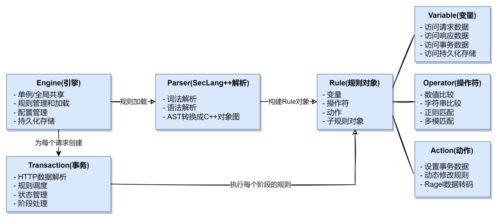
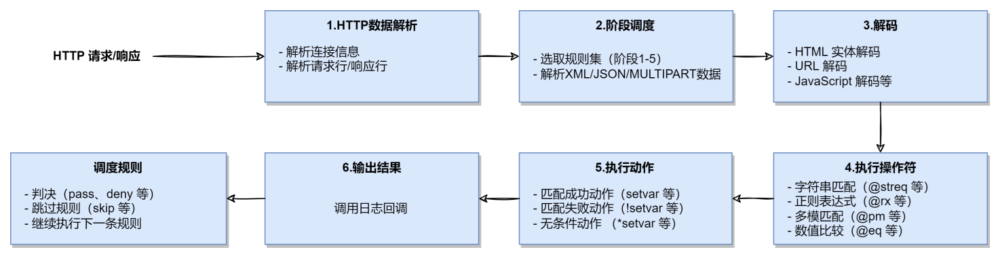
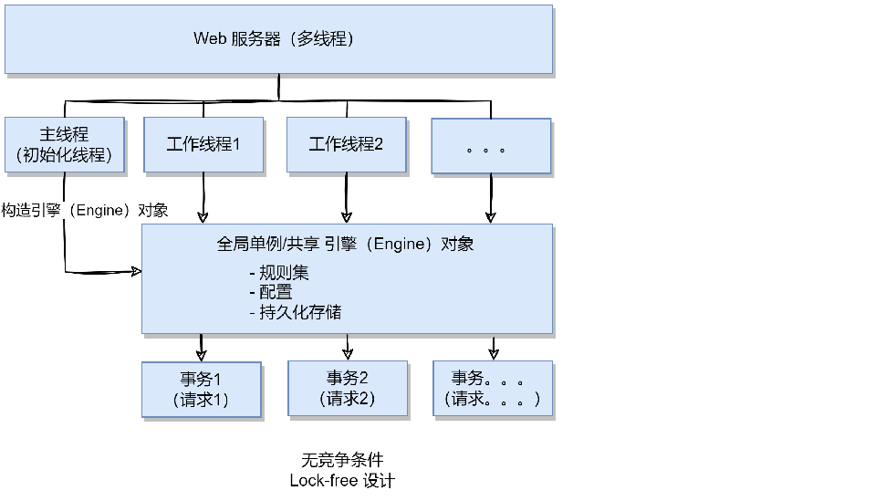

+++
title = "架构概览"
weight = 2
+++
- [组件关系图](#组件关系图)
  - [引擎（Engine）](#引擎engine)
  - [SecLang++解析（Parser）](#seclang解析parser)
  - [规则对象（Rule）](#规则对象rule)
  - [事务（Transaction）](#事务transaction)
- [规则执行流程](#规则执行流程)
  - [1.HTTP数据解析](#1http数据解析)
  - [2.阶段调度](#2阶段调度)
  - [3.解码](#3解码)
  - [4.执行操作符](#4执行操作符)
  - [5.执行动作](#5执行动作)
  - [6.输出结果](#6输出结果)
  - [7.调度规则](#7调度规则)
- [线程模型](#线程模型)
- [总结](#总结)
## 组件关系图


### 引擎（Engine）
**Engine** 是 WGE 的核心，一般以单例模式存在，职责包括：
- **规则加载** - 从文件或配置指令加载规则集
- **规则解析** - 使用 Parser 解析 SecLang++ 规则
- **事务创建** - 为每个 HTTP 请求创建事务对象
- **规则组织** - 按阶段（Phase）组织和管理规则
- **配置管理** - 管理引擎配置和审计日志配置
- **持久化存储** - 管理持久化存储接口，使多个事务能够共享数据

### SecLang++解析(Parser)
**Parser** 使用 ANTLR4 实现，负责将 SecLang++ 规则文本解析为抽象语法树（AST），并构建C++对象图，供引擎调用执行。
- **词法解析** - 将规则文本分解为标记（Tokens）
- **语法解析** - 根据 SecLang++ 语法规则生成 AST
- **构建Rule对象** - 将 AST 转换为可执行的 Rule 对象

### 规则对象（Rule）
**Rule** 对象包含单条SecLang++规则的所有信息，包括变量、操作符和动作，供事务在处理请求时评估（执行）。规则对象被设计为无状态的，可在多个事务间共享。
- **变量** - 规则中使用的变量，是规则被评估时的输入。变量对象是无状态的，只包含数据提取逻辑，通过事务传入的上下文（如请求数据）进行实际的数据提取。可访问的变量类型包括请求变量（如 ARGS）、响应变量（如 RESPONSE_BODY）、事务变量（如 TX）和特殊变量（如 PTREE 以及持久化存储数据）。
- **操作符** - 规则中使用的匹配逻辑，用于对变量值进行评估。操作符对象也是无状态的，只包含匹配逻辑，通过传入的变量值进行实际的匹配计算。支持的操作符类型包括数值比较（如 @eq）、字符串匹配（如 @streq）、正则表达式（如 @rx）、多模匹配（如 @pm）等。
- **动作** - 根据操作符的评估结果执行的操作，分为**匹配前动作**、**匹配成功动作**、**匹配失败动作** 以及**无条件动作**。动作对象同样是无状态的，只包含动作逻辑，通过传入的事务上下文执行实际的操作。支持的动作类型包括设置事务数据（如 setvar）、动态修改规则（如 ctl）等。
  - **匹配前动作** - 在使用操作符对变量值进行评估前的执行的动作，主要用于预处理变量值。例如Ragel转码函数（html_entity_decode、js_decode等）。这些转码函数使用Ragel实现的高性能DFA解码函数，对变量值进行解码转换，防止攻击载荷通过编码绕过检测。
  - **匹配成功动作** - 当规则匹配成功时执行的动作，如设置变量（setvar）。
  - **匹配失败动作** - 当规则匹配失败时执行的动作，如设置变量（!setvar）。
  - **无条件动作** - 无论规则是否匹配均执行的动作，如设置变量（*setvar）。

### 事务（Transaction）
`Transaction` 代表单个 HTTP 请求/响应的处理流程，职责包括：
- **HTTP 数据解析** - 解析连接信息、请求行、响应行、XML/JSON 数据等
- **规则调度** - 逐条评估规则，并根据规则的skip指令跳过不必要的规则
- **状态管理** - 维护事务状态和事务变量（TX变量）存储
- **阶段处理** - 按照 5 个阶段顺序处理请求/响应：
  - Phase 1: REQUEST_HEADERS（请求头处理）
  - Phase 2: REQUEST_BODY（请求体处理）
  - Phase 3: RESPONSE_HEADERS（响应头处理）
  - Phase 4: RESPONSE_BODY（响应体处理）
  - Phase 5: LOGGING（日志记录）

## 规则执行流程
对每个 HTTP 请求，WGE引擎创建一个独立的事务（Transaction）实例。该实例负责处理该请求的整个生命周期，包括解析HTTP数据、按阶段调度规则评估以及维护事务状态。事务在处理请求时，按以下步骤执行规则：

### 1.HTTP数据解析
事务首先解析HTTP数据，提取连接信息、请求行、请求头、请求体、响应行、响应头、响应体等内容，供后续规则评估使用。相应接口包括：
   - `Transaction::processConnection()`
```c++
/**
 * Process the connection info.
 * @param downstream_ip the downstream ip.
 * @param downstream_port the downstream port.
 * @param upstream_ip the upstream ip.
 * @param upstream_port the upstream port.
 */
void processConnection(std::string_view downstream_ip, short downstream_port,
                        std::string_view upstream_ip, short upstream_port);
```
   - `Transaction::processUri()`
```c++
/**
 * Process the uri info.
 * @param request_line the request line. include method, path, query, protocol, version.
 * E.g. GET / HTTP/1.1
 */
void processUri(std::string_view request_line);

/**
 * Process the uri info.
 * @param uri the uri. E.g. /hello/world
 * @param method the method. E.g. GET
 * @param version the version. E.g. 1.1
 */
void processUri(std::string_view uri, std::string_view method, std::string_view version);
```

### 2.阶段调度
事务按5个阶段顺序处理请求/响应。在每个阶段，事务获取该阶段的规则列表，并逐条评估规则。阶段包括：
   - 阶段 1: 请求头 (request headers)
   - 阶段 2: 请求体 (request body)
   - 阶段 3: 响应头 (response headers)
   - 阶段 4: 响应体 (response body)
   - 阶段 5: 日志记录

    相应的接口包括：
   - `Transaction::processRequestHeaders()`
```c++
/**
 * Process the request headers.
 * @param request_header_find the header find function.
 * @param request_header_traversal the header traversal function.
 * @param request_header_count the count of the headers.
 * @param log_callback the log callback. if the rule is matched, the log_callback will be called.
 * @param log_user_data the user data pointer for the log callback.
 * @param additional_cond an "AND" logic based on the original logic of the rule, only if both
 * match successfully is the final result true.
 * @param additional_cond_user_data the user data pointer for the additional condition callback.
 * @return true if the request is safe, false otherwise that means need to deny the request.
 */
bool processRequestHeaders(HeaderFind request_header_find,
                            HeaderTraversal request_header_traversal, size_t request_header_count,
                            LogCallback log_callback = nullptr, void* log_user_data = nullptr,
                            AdditionalCondCallback additional_cond = nullptr,
                            void* additional_cond_user_data = nullptr);
```

   - `Transaction::processRequestBody()`
```c++
/**
 * Process the request body.
 * @param body the request body.
 * @param log_callback the log callback. if the rule is matched, the log_callback will be called.
 * @param log_user_data the user data pointer for the log callback.
 * @param additional_cond an "AND" logic based on the original logic of the rule, only if both
 * match successfully is the final result true.
 * @param additional_cond_user_data the user data pointer for the additional condition callback.
 * @return true if the request is safe, false otherwise that means need to deny the request.
 */
bool processRequestBody(std::string_view body, LogCallback log_callback = nullptr,
                        void* log_user_data = nullptr,
                        AdditionalCondCallback additional_cond = nullptr,
                        void* additional_cond_user_data = nullptr);
```

   - `Transaction::processResponseHeaders()`
```c++
/**
 * Process the response headers.
 * @param status_code the status code of the response. E.g. 200
 * @param protocol the protocol of the response. E.g. HTTP/1.1
 * @param response_header_find the header find function.
 * @param response_header_traversal the header traversal function.
 * @param response_header_count the count of the headers.
 * @param log_callback the log callback. if the rule is matched, the log_callback will be called.
 * @param log_user_data the user data pointer for the log callback.
 * @param additional_cond an "AND" logic based on the original logic of the rule, only if both
 * match successfully is the final result true.
 * @param additional_cond_user_data the user data pointer for the additional condition callback.
 * @return true if the request is safe, false otherwise that means need to deny the request.
 */
bool processResponseHeaders(std::string_view status_code, std::string_view protocol,
                        HeaderFind response_header_find,
                        HeaderTraversal response_header_traversal,
                        size_t response_header_count, LogCallback log_callback = nullptr,
                        void* log_user_data = nullptr,
                        AdditionalCondCallback additional_cond = nullptr,
                        void* additional_cond_user_data = nullptr);
```

   - `Transaction::processResponseBody()`
```c++
/**
 * Process the response body.
 * @param body the response body.
 * @param log_callback the log callback. if the rule is matched, the log_callback will be called.
 * @param log_user_data the user data pointer for the log callback.
 * @param additional_cond an "AND" logic based on the original logic of the rule, only if both
 * match successfully is the final result true.
 * @param additional_cond_user_data the user data pointer for the additional condition callback.
 * @return true if the request is safe, false otherwise that means need to deny the request.
 */
bool processResponseBody(std::string_view body, LogCallback log_callback = nullptr,
                        void* log_user_data = nullptr,
                        AdditionalCondCallback additional_cond = nullptr,
                        void* additional_cond_user_data = nullptr);
```

### 3.解码
在规则评估过程中，若规则包含匹配前动作（如Ragel转码函数），事务会先执行这些动作对变量值进行预处理，然后再使用操作符进行评估。
包括 HTML 实体解码（htmlEntityDecode）、JavaScript 解码（jsDecode）、CSS 解码（cssDecode）、URL 解码（urlDecode）等22种常见转码格式，确保攻击载荷无法通过编码变换绕过检测。
这些解码函数使用 Ragel 实现的高性能 DFA 解码引擎，能够高效地处理大量数据，适用于高并发场景。

### 4.执行操作符
事务将变量值传递给规则的操作符对象，执行匹配逻辑，得到匹配结果（成功或失败）。
### 5.执行动作
根据操作符的评估结果，事务执行相应的动作（匹配成功动作、匹配失败动作或无条件动作），如设置事务变量（setvar）、动态修改规则（ctl）等。
### 6.输出结果
如果规则匹配成功，事务会调用用户传入的日志回调函数（ processRequestHeaders 等接口中的 log_callback 参数）。
### 7.调度规则
事务继续评估该阶段的下一条规则，直到所有规则均被评估完毕或遇到提前结束事务的动作（allow、deny）为止。然后进入下一个阶段，重复上述流程，直至所有阶段处理完成。

## 线程模型

WGE 采用无锁（Lock-free）设计：

- 引擎（Engine） 实例通常为单例或全局共享
- 事务（Transaction） 为每个请求单独创建，不在线程间共享
- 变量、规则等共享数据被设计为只读的无状态对象，避免竞争条件
- 支持高并发场景下的高效操作


## 总结

WGE 的架构设计重点关注以下方面：

1. **兼容性** - 100% 兼容 OWASP CRS 规则集
2. **性能** - 相比 ModSecurity 性能提升 4 倍以上
3. **可扩展性** - 模块化设计支持灵活的功能扩展
4. **易用性** - 简洁的 API 和完善的集成示例及文档
5. **现代化** - 使用 C++23 现代特性构建